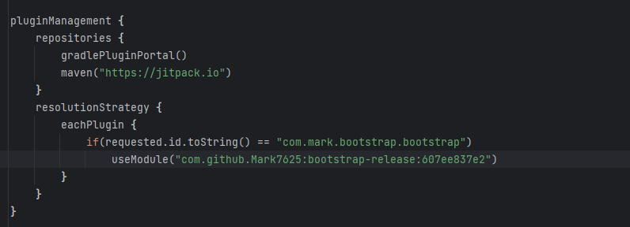
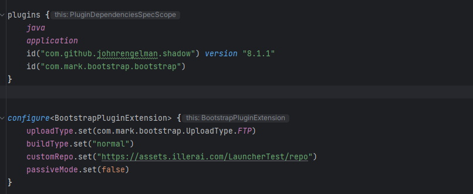
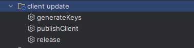
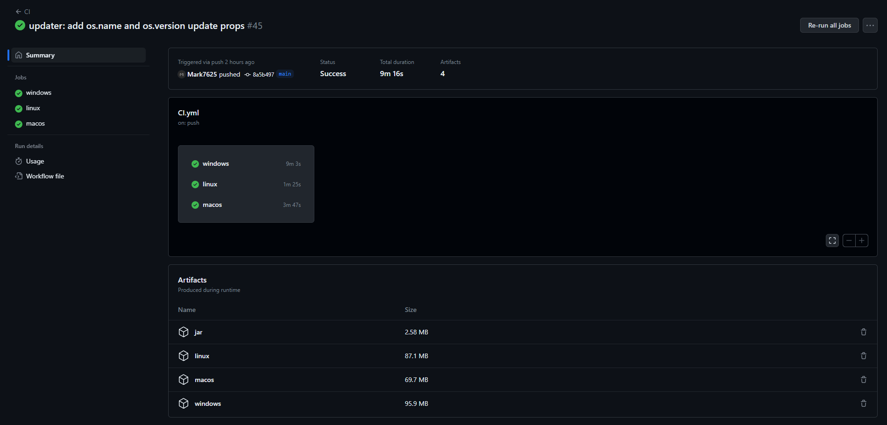

# Setting Up

### Requirements:

<details>
  <summary>Ftp Setup</summary>
    Coming Soon
</details>


<details>
  <summary>Adding Release Plugin into your Client (Gradle)</summary>
####  Setting up the release plugin

### settings.gradle.kts



Replace 607ee837e2 with the latest version found here https://jitpack.io/#Mark7625/bootstrap-release

### build.gradle

In the Plugin block add 
```Kotlin
  id("com.mark.bootstrap.bootstrap")
```

Under that add

```Kotlin
configure<BootstrapPluginExtension> {
    uploadType.set(com.mark.bootstrap.UploadType.FTP)
    buildType.set("normal")
    customRepo.set("https://assets.illerai.com/LauncherTest/repo")
    passiveMode.set(false)
}
```

And edit the repo like for custom libs you have any. This should be the final result



</details>

<details>
  <summary>Setting up the Template</summary>

### Template

At the root of your project make a file called bootstrap.template this will allow the bootstrap save any custom args you wish to use. These are taken from runelite

```json
{
    "clientJvm17Arguments": [
    "-XX:+DisableAttachMechanism",
    "-Xmx812m",
    "-Xss2m",
    "-XX:CompileThreshold=1500"
    ],
    "clientJvm17MacArguments": [
    "-XX:+DisableAttachMechanism",
    "-Xmx812m",
    "-Xss2m",
    "-XX:CompileThreshold=1500",
    "--add-opens=java.desktop/com.apple.eawt=ALL-UNNAMED"
    ],
    "clientJvm9Arguments": [
    "-XX:+DisableAttachMechanism",
    "-Drunelite.launcher.blacklistedDlls=RTSSHooks.dll,RTSSHooks64.dll,NahimicOSD.dll,NahimicMSIOSD.dll,Nahimic2OSD.dll,Nahimic2DevProps.dll,k_fps32.dll,k_fps64.dll,SS2DevProps.dll,SS2OSD.dll,GTIII-OSD64-GL.dll,GTIII-OSD64-VK.dll,GTIII-OSD64.dll",
    "-Xmx812m",
    "-Xss2m",
    "-XX:CompileThreshold=1500"
    ],
    "clientJvmArguments": [
    "-XX:+DisableAttachMechanism",
    "-Xmx812m",
    "-Xss2m",
    "-XX:CompileThreshold=1500",
    "-Xincgc",
    "-XX:+UseConcMarkSweepGC",
    "-XX:+UseParNewGC"
    ],
    "launcherArguments": [
    "-XX:+DisableAttachMechanism",
    "-Drunelite.launcher.nojvm=true",
    "-Xmx812m",
    "-Xss2m",
    "-XX:CompileThreshold=1500",
    "-Xincgc",
    "-XX:+UseConcMarkSweepGC",
    "-XX:+UseParNewGC"
    ],
    "launcherJvm11Arguments": [
    "-XX:+DisableAttachMechanism",
    "-Drunelite.launcher.nojvm=true",
    "-Xmx812m",
    "-Xss2m",
    "-XX:CompileThreshold=1500"
    ],
    "launcherJvm11WindowsArguments": [
    "-XX:+DisableAttachMechanism",
    "-Drunelite.launcher.nojvm=true",
    "-Drunelite.launcher.blacklistedDlls=RTSSHooks.dll,RTSSHooks64.dll,NahimicOSD.dll,NahimicMSIOSD.dll,Nahimic2OSD.dll,Nahimic2DevProps.dll,k_fps32.dll,k_fps64.dll,SS2DevProps.dll,SS2OSD.dll,GTIII-OSD64-GL.dll,GTIII-OSD64-VK.dll,GTIII-OSD64.dll",
    "-Xmx812m",
    "-Xss2m",
    "-XX:CompileThreshold=1500"
    ],
    "launcherJvm17Arguments": [
    "-XX:+DisableAttachMechanism",
    "-Drunelite.launcher.nojvm=true",
    "-Xmx512m",
    "-Xss2m",
    "-XX:CompileThreshold=1500"
    ],
    "launcherJvm17MacArguments": [
    "-XX:+DisableAttachMechanism",
    "-Drunelite.launcher.nojvm=true",
    "-Xmx812m",
    "-Xss2m",
    "-XX:CompileThreshold=1500",
    "--add-opens=java.desktop/com.apple.eawt=ALL-UNNAMED"
    ],
    "launcherJvm17WindowsArguments": [
    "-XX:+DisableAttachMechanism",
    "-Drunelite.launcher.nojvm=true",
    "-Drunelite.launcher.blacklistedDlls=RTSSHooks.dll,RTSSHooks64.dll,NahimicOSD.dll,NahimicMSIOSD.dll,Nahimic2OSD.dll,Nahimic2DevProps.dll,k_fps32.dll,k_fps64.dll,SS2DevProps.dll,SS2OSD.dll,GTIII-OSD64-GL.dll,GTIII-OSD64-VK.dll,GTIII-OSD64.dll",
    "-Xmx812m",
    "-Xss2m",
    "-XX:CompileThreshold=1500"
    ]
}
```
</details>

<details>
  <summary>Setting up the Launcher</summary>

* Once you have added the release plugin into the client
* Copy your launcher.crt that you made  into /resources/net/runelite/launcher/
* Go into launcher.properties And edit the following 
```kotlin
https://assets.illerai.com/LauncherTest/ClientManifest.json
```

Should link should go to a json on your webhost or aws that looks like this 
```json
[
  {
    "name": "Normal",
    "main": "com.telos.Bootstrap",
    "bootstrap": "https://assets.illerai.com/LauncherTest/bootstrap.json",
    "bootstrapsig": "https://assets.illerai.com/LauncherTest/bootstrap.json.sha256",
    "tooltip": "The Latest most stable Client"
  }
]
```

These are the clients that the users can download, if you only have 1 client it will skip
asking the user and download right away, if you have more then 2 clients it will ask what client they would like to play


- Name: The Name of the client,
- Main: This the main run point of the client EG: [net.runelite.client.RuneLite],
- Bootstrap: This is where the bootstrap file of the this client is located
- Bootstrap Sig: This is where the bootstrap Sig file of the this client is located
- Tooltip: This the tooltip that shows when hovering over the button

</details>

<details>
  <summary>Branding</summary>

### Branding
## Names

1) Go into launcher.properties And edit 'elvarg' and links to your server links and name

```kotlin
runelite.launcher.version=${project.version}  
runelite.discord.invite=**https://runelite.net/redirect/launcher/discord**  
runelite.wiki.troubleshooting.link=**https://runelite.net/redirect/launcher/troubleshooting**  
runelite.dnschange.link=https://1.1.1.1/dns/#setup-instructions  
runelite.download.link=https://**elvarg**.net/download/  
runelite.website=https://**elvarg**.net/  
runelite.bootstrap=https://elvarg.s3.eu-west-2.amazonaws.com/bootstrap.json  
runelite.bootstrapsig=https://elvarg.s3.eu-west-2.amazonaws.com/bootstrap.json.sha256  
runelite.name=**Elvarg**  
runelite.main=net.runelite.client.RuneLite
```

2) Inside Intellij click the root of the project and press CTRL + ALT + R

This will bring this window up


Make sure CC is selected and replace 'Elvarg' with 'MyCoolName' MAKE SURE ITS CAPS E same with the server name

3) Inside Intellij click the root of the project and press CTRL + ALT + R

Make sure CC is selected and replace 'elvarg' with 'myCoolName' MAKE SURE ITS LOWERCASE E same with the server name


## Icons / Images

1. /app.ico [128x128] [Transparent Background]
2. /app_small.bmp [60x60] [White Background]
3. /left.bmp [164x314] [Any Background]
4. /appimage/app.png [128x128]  [Transparent Background]
5. /osx/app.icns https://img2icnsapp.com/how-to-create-the-best-mac-icons/

## Colors

Inside ColorScheme.java you will where you can edit all your RBG colors

```java
/* The blue color used for the branding's accents */
public static final Color BRAND = new Color(220, 138, 0);

/* The blue color used for the branding's accents, with lowered opacity */
public static final Color BRAND_TRANSPARENT = new Color(220, 138, 0, 120);


public static final Color DARK_GRAY_COLOR = new Color(40, 40, 40);
public static final Color DARKER_GRAY_COLOR = new Color(30, 30, 30);
public static final Color MEDIUM_GRAY_COLOR = new Color(77, 77, 77);

/* The background color of the scrollbar's track */
public static final Color SCROLL_TRACK_COLOR = new Color(25, 25, 25);

/* The color for the red progress bar (used in ge offers, farming tracker, etc)*/
public static final Color PROGRESS_ERROR_COLOR = new Color(230, 30, 30);
```

</details>

### Tasks
- Generate Keys - Generates new keys for the launcher
- Makes Release files and auto dates to ftp
- Release - Just makes the boostrap and the jar to upload manually



## Getting your files

Once you have pushed your files to github, github actions will build your launcher you can then find them under the workflow action it runs EG: https://github.com/Elvarg-Community/Runelite-Launcher-rsps/actions/runs/3014844052



# Credits
    - Runelite For the base
    - Spooky For helping me understand the sha stuff

If you need any help or want setup done for a service add me on discord [Mark_] (724620008658829363)
